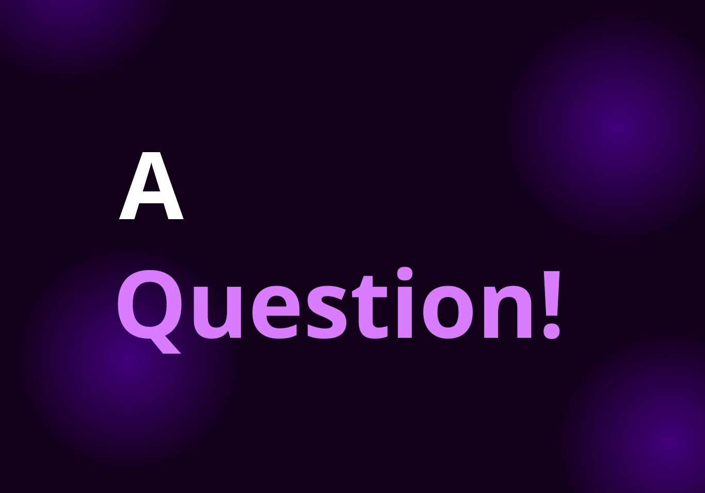

# Sorpresa web (Next.js + TypeScript)

Ir: https://himself10.github.io/sorpresa/

Una mini experiencia interactiva, corta y directa. Entra sin expectativas.

## Qué incluye

- **Next.js (App Router) + TypeScript**
- **React 19**
- **Una sola página**: `src/app/page.tsx`
- **UI centrada** (vertical y horizontal), con **fondo oscuro + grid animada**
- **Tarjeta principal** con CTA **"Sí"** y **"No"**
- **Interacciones en cliente**:
  - El botón **"No"** tiene **cuenta regresiva** (10 → 1)
  - Al final ocurre una secuencia: **"Sí"** invade el espacio, **"No"** es empujado y **explota**
  - Si presionas **"No"** muy rápido, puede **terminar contando como "Sí"**
  - **Rastro del cursor** (en móvil se mueve solo), en `src/app/components/CursorTrail.tsx`
- **Estilos** con Tailwind v4 (vía `@import "tailwindcss";`) + CSS propio en `src/app/styles/`

### Estructura rápida

- **Entrada**: `src/app/page.tsx`
- **Layout**: `src/app/layout.tsx`
- **Componentes**: `src/app/components/`
  - `EvasiveButton.tsx` (lógica del botón “No”)
  - `CursorTrail.tsx` (rastro del cursor)
- **Copy/textos**: `src/app/utils/romanceCopy.ts`
- **Estilos**: `src/app/styles/` (incluye `globals.css`)

### Personalización rápida

- **Textos** (título, labels, mensaje final): `src/app/utils/romanceCopy.ts`
- **Comportamiento del “No”** (velocidad/escala, límite): `src/app/components/EvasiveButton.tsx`
- **Animaciones/fondo**: `src/app/page.tsx` y `src/app/styles/*`

### Assets (icono y preview)

Coloca estos archivos en:

- `public/assets/icono.png` (icono / favicon)
- `public/assets/image.png` (imagen para Open Graph / Twitter)

### Licencia

Este proyecto está bajo la licencia **Apache 2.0**. Ver `LICENSE`.

> **Desarrollado por Fravelz**
